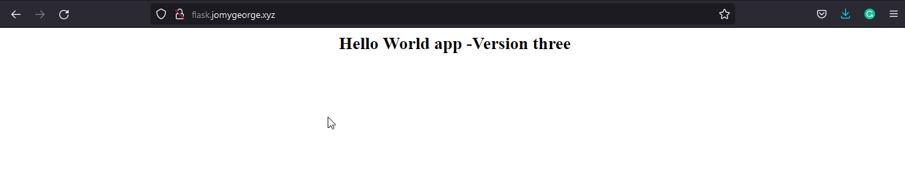

# Ansible-image-and-container-creation-using-latest-git-repo

Playbook to insatll Docker and build a simple html application image from a dockerfile and then it pushed to your Docker Hub account.

## Ansible Modules used

- yum
- pip
- service
- git
- docker_image
- docker_container
- docker_login

## How to Use

```
git clone https://github.com/Ansible-image-and-container-creation-using-latest-git-repo.git
cd Ansible-image-and-container-creation-using-latest-git-repo
ansible-playbook -i hosts main.yml
```

## Behind the code

```sh
---

- name: "Building Docker Image and container from GITHUB"
  hosts: amazon
  become: true
  vars:
    packages:
      - git
      - pip
      - docker
    repo_url: "https://github.com/jomyg/git-flask-app.git"                 ## The git repo url which we are using to the build the docker image
    repo_dir: "/var/flaskapp/"                                             ## The new repo will get cloned on remote location /var/flaskapp/
    docker_user: "jomyg"
    docker_password: "***********"
    image_name: "jomyg/flaskone"                                           ## Image name which you wanted to set

  tasks:


    - name: " We are Installing pip, docker & git"
      yum:
        name: "{{ packages }}"
        state: present

    - name: " Installing Python extension for docker communication. Please wait"        ## For docker python communication
      pip:
        name: docker-py

    - name: "Adding Ec2-user to docker group for access"                                ## For user "ec2-user" to access the remote meachine docker service
      user:
        name: "ec2-user"
        groups:
          - docker
        append: true


    - name: "Restarting and enabling Docker if need"
      service:
        name: docker
        state: started
        enabled: true

    - name: "Clonning the repo using {{ repo_url }}"                                  ## Clonning the repo to remote /var/flaskapp/
      git:
        repo: "{{repo_url}}"
        dest: "{{ repo_dir }}"
      register: git_status


    - name: "Logging into the docker-hub official"                                     ## Accessing the docker hub to push the new building images
      when: git_status.changed == true
      docker_login:
        username: "{{ docker_user }}"
        password: "{{ docker_password }}"
        state: present


    - name: "Creating docker Image and push To your docker-hub now. Please wait"       ## Image created using the repo files and pushed to docker hub
      when: git_status.changed == true
      docker_image:
        source: build
        build:
          path: "{{ repo_dir }}"
          pull: yes
        name: "{{ image_name }}"
        tag: "{{ item }}"
        push: true
        force_tag: yes
        force_source: yes
      with_items:
        - "{{ git_status.after }}"
        - latest

    - name: "Deleting Local Image From Build Server"                                    ## Deleting the unused image        
      when: git_status.changed == true
      docker_image:
        state: absent
        name: "{{ image_name }}"
        tag: "{{ item }}"
      with_items:
        - "{{ git_status.after }}"
        - latest

    - name: "Pulling the docker Image from hub "                                        ## After all image creation and push. we are pulling the latest image from hub
      docker_image:
        name: "jomyg/flaskone:latest"
        source: pull
        force_source: true
      register: image_status

    - name: " Creating the Container from above fecthed image"                          ## Creating container from the latest image which docker pulled from the hub 
      when: image_status.changed == true
      docker_container:
        name: helloworddflaskapp
        image: "{{ image_name }}:latest"
        recreate: yes
        pull: yes
        published_ports:
          - "80:80"
  ```

> Lets run the ansible playbook

```sh
~]$ ansible-playbook -i hosts main.yml

PLAY [Building Docker Image and container from GITHUB] *****************************************************************************************************************

TASK [Gathering Facts] *************************************************************************************************************************************************
ok: [172.31.11.210]

TASK [We are Installing pip, docker & git] *****************************************************************************************************************************
ok: [172.31.11.210]

TASK [Installing Python extension for docker communication. Please wait] ***********************************************************************************************
ok: [172.31.11.210]

TASK [Adding Ec2-user to docker group for access] **********************************************************************************************************************
ok: [172.31.11.210]

TASK [Restarting and enabling Docker if need] **************************************************************************************************************************
ok: [172.31.11.210]

TASK [Clonning the repo using https://github.com/jomyg/git-flask-app.git] **********************************************************************************************
changed: [172.31.11.210]

TASK [Logging into the docker-hub official] ****************************************************************************************************************************
ok: [172.31.11.210]

TASK [Creating docker Image and push To your docker-hub now. Please wait] **********************************************************************************************
changed: [172.31.11.210] => (item=10a2afc660e3620292bdf47affd07928a9839df1)
ok: [172.31.11.210] => (item=latest)

TASK [Deleting Local Image From Build Server] **************************************************************************************************************************
changed: [172.31.11.210] => (item=10a2afc660e3620292bdf47affd07928a9839df1)
changed: [172.31.11.210] => (item=latest)

TASK [Pulling the docker Image from hub] *******************************************************************************************************************************
changed: [172.31.11.210]

TASK [Creating the Container from above fecthed image] *****************************************************************************************************************
changed: [172.31.11.210]

PLAY RECAP *************************************************************************************************************************************************************
172.31.11.210              : ok=11   changed=5    unreachable=0    failed=0    skipped=0    rescued=0    ignored=0
```
```
After creation on client server. See the contaier is UP and running fine
[ec2-user@ip-172-31-11-210 ~]$ docker container ls
CONTAINER ID   IMAGE                   COMMAND            CREATED              STATUS         PORTS                NAMES
4ae75ac51047   jomyg/flaskone:latest   "python3 app.py"   About a minute ago   Up 3 seconds   0.0.0.0:80->80/tcp   helloworddflaskapp

```

> If we run the same whithout any changes on docker image repository, it will skip the creation and build

 ```
~]$ ansible-playbook -i hosts main.yml

PLAY [Building Docker Image and container from GITHUB] *****************************************************************************************************************

TASK [Gathering Facts] *************************************************************************************************************************************************
ok: [172.31.11.210]

TASK [We are Installing pip, docker & git] *****************************************************************************************************************************
ok: [172.31.11.210]

TASK [Installing Python extension for docker communication. Please wait] ***********************************************************************************************
ok: [172.31.11.210]

TASK [Adding Ec2-user to docker group for access] **********************************************************************************************************************
ok: [172.31.11.210]

TASK [Restarting and enabling Docker if need] **************************************************************************************************************************
ok: [172.31.11.210]

TASK [Clonning the repo using https://github.com/jomyg/git-flask-app.git] **********************************************************************************************
ok: [172.31.11.210]

TASK [Logging into the docker-hub official] ****************************************************************************************************************************
skipping: [172.31.11.210]

TASK [Creating docker Image and push To your docker-hub now. Please wait] **********************************************************************************************
skipping: [172.31.11.210] => (item=10a2afc660e3620292bdf47affd07928a9839df1)
skipping: [172.31.11.210] => (item=latest)

TASK [Deleting Local Image From Build Server] **************************************************************************************************************************
skipping: [172.31.11.210] => (item=10a2afc660e3620292bdf47affd07928a9839df1)
skipping: [172.31.11.210] => (item=latest)

TASK [Pulling the docker Image from hub] *******************************************************************************************************************************
ok: [172.31.11.210]

TASK [Creating the Container from above fecthed image] *****************************************************************************************************************
skipping: [172.31.11.210]

PLAY RECAP *************************************************************************************************************************************************************
172.31.11.210              : ok=7    changed=0    unreachable=0    failed=0    skipped=4    rescued=0    ignored=0
```
<center> </img></center>

## Conclusion

Ansible playbook docker image push and pull latest using the github repo. If developer do any change on the dockerfile which placed on git. This will recreate the image and container without skipping.

#### ⚙️ Connect with Me

<p align="center">
<a href="mailto:jomyambattil@gmail.com"></a>
<a href="https://www.linkedin.com/in/jomygeorge11"></a> 
<a href="https://www.instagram.com/therealjomy"></a><br />
